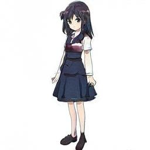

> **tl;dr** A step-by-step tutorial to automatically generate anime characters (full-body) using a StyleGAN2 model. 

## Practical Machine Learning - Learn Step-by-Step to Train a Model

A great way to learn is by going step-by-step through the process of training and evaluating the model.

Hit the **`Open in Colab`** button below to launch a Jupyter Notebook in the cloud with a step-by-step walkthrough.
[](https://colab.research.google.com/github/eugenesiow/practical-ml/blob/master/notebooks/Anime_Character_Generation_with_StyleGAN2.ipynb "Open in Colab")

Continue on if you prefer reading the code here.

## Anime Character Generation with StyleGAN2

---

Notebook to generate anime characters using a pre-trained StyleGAN2 model. 

We utilise the awesome lucidrains's [stylegan2-pytorch](https://github.com/lucidrains/stylegan2-pytorch) library with our [pre-trained model](https://huggingface.co/eugenesiow/ani-chara-gan) to generate 128x128 female anime characters.

The notebook is structured as follows:
* Setting up the Environment
* Using the Models (Running Inference)

# Setting up the Environment

#### Ensure we have a GPU runtime

If you're running this notebook in Google Colab, select `Runtime` > `Change Runtime Type` from the menubar. Ensure that `GPU` is selected as the `Hardware accelerator`. This will allow us to use the GPU to train the model subsequently.

The library requires that you have access to a `GPU`.


#### Setup Dependencies

We need to setup the `stylegan2_pytorch` library so lets install it.


```
!pip install -q stylegan2_pytorch==1.5.10
```

# Using the Model (Running Inference)

First we download the checkpoint weights from the pre-trained model which is stored on the superb huggingface model hub.

We make use of the `torch.hub.download_url_to_file` function to download the model weights stored in a `.pt` file to a folder stucture we have created.


```
import torch
from pathlib import Path

Path('/content/models/ani-chara-gan/').mkdir(parents=True, exist_ok=True)
torch.hub.download_url_to_file('https://huggingface.co/eugenesiow/ani-chara-gan/resolve/main/model.pt',
                               '/content/models/ani-chara-gan/model_150.pt')
torch.hub.download_url_to_file('https://huggingface.co/eugenesiow/ani-chara-gan/resolve/main/.config.json',
                               '/content/models/ani-chara-gan/.config.json')
```


Next we run inference to generate our image from the Anime Character GAN.

Specifically we are running the following steps:

* Load the model using lucidrain's library and the `ModelLoader` convenience function. The model is loaded from the directory we have downloaded the pre-trained model to `/content/models/ani-chara-gan/`.
* Randomly initialise with some `noise`.
* Use the convenience function `noise_to_styles`. This basically passes the noise vector through the network to get the style vector. At the backend, this calls `model.GAN.SE(noise)`.
* Use the convenience function `styles_to_images` to call the generator on the style vector. At the backend, this roughly calls `model.GAN.GE(styles)`.
* Save the output vector to an image with `save_image`.
* Display the saved image with `cv2_imshow`.


```
import torch
import cv2
from google.colab.patches import cv2_imshow
from torchvision.utils import save_image
from stylegan2_pytorch import ModelLoader

loader = ModelLoader(
    base_dir = '/content/', name = 'ani-chara-gan'
)

noise   = torch.randn(1, 256).cuda() # noise
styles  = loader.noise_to_styles(noise, trunc_psi = 0.7)  # pass through mapping network
images  = loader.styles_to_images(styles) # call the generator on intermediate style vectors

save_image(images, './sample.jpg')
cv2_imshow(cv2.imread('./sample.jpg'))
```





We can connect to Google Drive with the following code. You can also click the `Files` icon on the left panel and click `Mount Drive` to mount your Google Drive.

The root of your Google Drive will be mounted to `/content/drive/My Drive/`. If you have problems mounting the drive, you can check out this [tutorial](https://towardsdatascience.com/downloading-datasets-into-google-drive-via-google-colab-bcb1b30b0166).


```
from google.colab import drive
drive.mount('/content/drive/')
```

You can move the output files which are saved in the `/content/` directory to the root of your Google Drive.


```
import shutil
shutil.move('/content/sample.jpg', '/content/drive/My Drive/sample.jpg')
```

## More Such Notebooks

Visit or star the [eugenesiow/practical-ml](https://github.com/eugenesiow/practical-ml) repository on Github for more such notebooks:



## Alternatives to Colab

Here are some alternatives to Google Colab to train models or run Jupyter Notebooks in the cloud:

- [Google Colab vs Paperspace Gradient](https://news.machinelearning.sg/posts/google_colab_vs_paperspace_gradient/)
