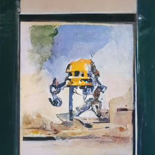

> **tl;dr** A step-by-step tutorial to generate art pieces from a text prompt. 

## Practical Machine Learning - Learn Step-by-Step to Train a Model

A great way to learn is by going step-by-step through the process of training and evaluating the model.

Hit the **`Open in Colab`** button below to launch a Jupyter Notebook in the cloud with a step-by-step walkthrough.
[](https://colab.research.google.com/github/eugenesiow/practical-ml/blob/master/notebooks/Art_Generation_with_v_Diffusion.ipynb "Open in Colab")

Continue on if you prefer reading the code here.


# Art Generation with v Diffusion

Notebook to generate artwork from an input prompt using a pre-trained model. 

We utilise the awesome [v-diffusion-jax](https://github.com/crowsonkb/v-diffusion-jax) library from the brilliant Katherine Crowson ([@RiversHaveWings](https://twitter.com/RiversHaveWings)) and Chainbreakers AI ([@jd_pressman](https://twitter.com/jd_pressman)) with the [pre-trained model](https://github.com/crowsonkb/v-diffusion-jax#model-checkpoints) to generate 256x256 art works. The model was trained on wiki art.

The models are denoising [diffusion probabilistic models](https://arxiv.org/abs/2006.11239), which are trained to reverse a gradual noising process, allowing the models to generate samples from the learned data distributions starting from random noise. DDIM-style [deterministic sampling](https://arxiv.org/abs/2010.02502) is also supported. The models are also trained on continuous timesteps. They use the 'v' objective from [Progressive Distillation for Fast Sampling of Diffusion Models](https://openreview.net/forum?id=TIdIXIpzhoI), hence the v in v-diffusion.

The notebook is structured as follows:
* Setting up the Environment
* Using the Models (Running Inference)

## Setting up the Environment

#### Ensure we have a GPU runtime

If you're running this notebook in Google Colab, select `Runtime` > `Change Runtime Type` from the menubar. Ensure that `GPU` is selected as the `Hardware accelerator`.

The models do require a `GPU` to run in a decent amount of time.

#### Setting up the Dependencies

First we will clone the `v-diffusion-jax` git repository from github and include `--recursive` so we get the `CLIP-JAX` repo as well.


```
!git clone --recursive https://github.com/crowsonkb/v-diffusion-jax.git
```

Next we install the required packages using `pip`.


```
%cd v-diffusion-jax/
!pip install -qr requirements.txt
```

# Using the Model (Running Inference)

First we download the checkpoint weights from the pre-trained model.

We want to create a `checkpoints` folder and download the model. We are using the `wikiart_256` model checkpoint.


```
!mkdir -p checkpoints
!wget -O checkpoints/wikiart_256.pkl https://v-diffusion.s3.us-west-2.amazonaws.com/wikiart_256.pkl
```

Next we run inference to generate our image from the prompt, using CLIP to guide the v diffusion. Feel free to change the input prompt and `seed`arguments.

It should take awhile to run the 1000 iterations.


```
!./clip_sample.py "a friendly robot, watercolor by James Gurney" --model wikiart_256 --seed 0
```

Our generated artwork is saved as `out_00000.png`, let's view it in our notebook.


```
import cv2
from google.colab.patches import cv2_imshow

cv2_imshow(cv2.imread('./out_00000.png'))
```





We can connect to Google Drive with the following code. You can also click the `Files` icon on the left panel and click `Mount Drive` to mount your Google Drive.

The root of your Google Drive will be mounted to `/content/drive/My Drive/`. If you have problems mounting the drive, you can check out this [tutorial](https://towardsdatascience.com/downloading-datasets-into-google-drive-via-google-colab-bcb1b30b0166).


```
from google.colab import drive
drive.mount('/content/drive/')
```

You can move the output files which are saved in the `/content/` directory to the root of your Google Drive.


```
import shutil
shutil.move('/content/v-diffusion-jax/out_00000.png', '/content/drive/My Drive/sample.jpg')
```

## More Such Notebooks

Visit or star the [eugenesiow/practical-ml](https://github.com/eugenesiow/practical-ml) repository on Github for more such notebooks:



## Alternatives to Colab

Here are some alternatives to Google Colab to train models or run Jupyter Notebooks in the cloud:

- [Google Colab vs Paperspace Gradient](https://news.machinelearning.sg/posts/google_colab_vs_paperspace_gradient/)
