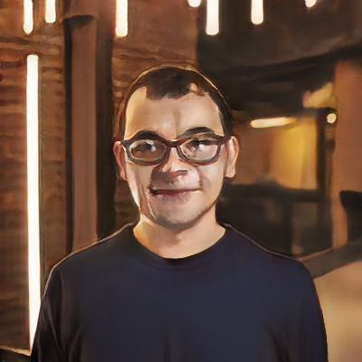
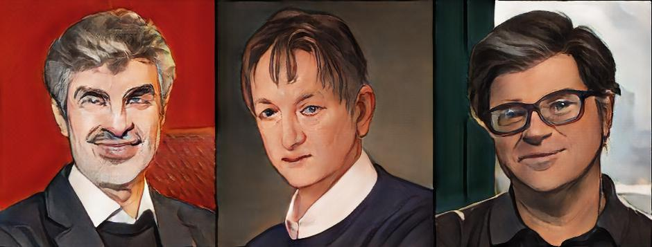

> **tl;dr** A step-by-step tutorial to use AnimeGANv2 models to automatically convert faces in photos to anime style faces. 

## Practical Machine Learning - Learn Step-by-Step to Train a Model

A great way to learn is by going step-by-step through the process of training and evaluating the model.

Hit the **`Open in Colab`** button below to launch a Jupyter Notebook in the cloud with a step-by-step walkthrough.
[](https://colab.research.google.com/github/eugenesiow/practical-ml/blob/master/notebooks/Face_to_Anime_with_AnimeGANv2.ipynb "Open in Colab")

Continue on if you prefer reading the code here.

## Face to Anime with AnimeGANv2

---

Notebook to convert faces from photos to anime style faces. If you haven't already, you should totally check out this [demo](https://huggingface.co/spaces/akhaliq/AnimeGANv2) on huggingface spaces by [Ahsen Khaliq](https://huggingface.co/akhaliq). The original repository and checkpoints are from this [animegan2-pytorch](https://github.com/bryandlee/animegan2-pytorch) repository on Github by bryandlee. The work to put this on torchhub was done by [xhlulu](https://github.com/xhlulu).

Currently the pre-trained models (checkpoints) available to use on this notebook are:
- celeba distill
- Face Portrait v2
- Face Portrait v1
- Paprika

The notebook is structured as follows:
* Setting up the Environment
* Getting Data
* Using the Model (Running Inference)

# Setting up the Environment

#### Dependencies and Runtime

If you're running this notebook in Google Colab, all the dependencies are already installed. 

If you decide to run this on many (>thousands) images and want the inference to go faster though, you can select `Runtime` > `Change Runtime Type` from the menubar. Ensure that `GPU` is selected as the `Hardware accelerator`.

## Getting Data

#### Getting an image to run through AnimeGANv2

* [Demis Hassabis](https://en.wikipedia.org/wiki/Demis_Hassabis), co-founder of DeepMind. From Twitter.

We'll save this image to our local storage and view a preview of it in our notebook.


```
import cv2
from urllib.request import urlretrieve
from google.colab.patches import cv2_imshow

# save the image to our local storage
urlretrieve('https://pbs.twimg.com/profile_images/691700243809718272/z7XZUARB_400x400.jpg', '/content/demis.jpg')

# display the image in the notebook
cv2_imshow(cv2.imread('/content/demis.jpg'))
```


## Using the Model (Running Inference)

First we load a model and define a function that will use the model to do the style transfer to convert our face to anime. 

* `torch.hub.load` - Loads the pre-trained model checkpoints and the model code from github. We first load the `face_paint_512_v2` model weights.
* `to_animegan2` - The function we define that takes in the input file path, loads it with PIL and converts it to a tensor. It then runs this tensor through the model and converts the tensor output back to a PIL image. The PIL image is returned from the function.


```
import torch
from PIL import Image
from torchvision.transforms.functional import to_tensor, to_pil_image

device = torch.device("cuda" if torch.cuda.is_available() else "cpu")
model = torch.hub.load("bryandlee/animegan2-pytorch:main", "generator", pretrained="face_paint_512_v2", device=device)
model.eval()

def to_animegan2(input_file):
  input_image = Image.open(input_file).convert('RGB')
  input_tensor = to_tensor(input_image).unsqueeze(0) * 2 - 1
  output = model(input_tensor.to(device)).cpu()[0]
  output = (output * 0.5 + 0.5).clip(0, 1)
  return to_pil_image(output)

```


Run the `to_animegan2` function on the photo of Demis that we downloaded previously, then display the output.


```
pil_image = to_animegan2('/content/demis.jpg')
display(pil_image)
```





Next, let's try a different model, the `celeba_distill` model. Let's load the model using `torch.hub.load` and run the original Demis image through our function and display the output.


```
model = torch.hub.load("bryandlee/animegan2-pytorch:main", "generator", pretrained="celeba_distill", device=device).eval()
display(to_animegan2('/content/demis.jpg'))
```


Now let's try the `parpika` model. Instead of directly outputting our output image to display, we instead save the image to our notebook/colab disk as `/content/demis_paprika.jpg`. We then display the image from disk.


```
model = torch.hub.load("bryandlee/animegan2-pytorch:main", "generator", pretrained="paprika", device=device).eval()
to_animegan2('/content/demis.jpg').save("/content/demis_paprika.jpg")
cv2_imshow(cv2.imread('/content/demis_paprika.jpg'))
```


Let's get another image, this time using the `torch.hub.download_url_to_file` function to download an image of the AI godfathers and save it to disk. We then display this original image.


```
torch.hub.download_url_to_file('https://www.cnet.com/a/img/LxPnVvP4ONxWlQmXOI4j-9m6d90=/940x0/2019/03/27/c36a11ff-4029-4eb2-8ca9-72143ea8e596/screen-shot-2019-03-27-at-11-51-29-am.png', '/content/godfathers.jpg')
cv2_imshow(cv2.imread('/content/godfathers.jpg'))
```


Let's try running it with the paprika model and saving the output.


```
to_animegan2('/content/godfathers.jpg').save("/content/godfathers_paprika.jpg")
cv2_imshow(cv2.imread('/content/godfathers_paprika.jpg'))
```





We can connect to Google Drive with the following code. You can also click the `Files` icon on the left panel and click `Mount Drive` to mount your Google Drive.

The root of your Google Drive will be mounted to `/content/drive/My Drive/`. If you have problems mounting the drive, you can check out this [tutorial](https://towardsdatascience.com/downloading-datasets-into-google-drive-via-google-colab-bcb1b30b0166).


```
from google.colab import drive
drive.mount('/content/drive/')
```

You can move the output files which are saved in the `/content/` directory to your Google Drive.


```
import shutil
shutil.move('/content/godfathers_paprika.jpg', '/content/drive/My Drive/godfathers_paprika.jpg')
```

## More Such Notebooks

Visit or star the [eugenesiow/practical-ml](https://github.com/eugenesiow/practical-ml) repository on Github for more such notebooks:



## Alternatives to Colab

Here are some alternatives to Google Colab to train models or run Jupyter Notebooks in the cloud:

- [Google Colab vs Paperspace Gradient](https://news.machinelearning.sg/posts/google_colab_vs_paperspace_gradient/)
